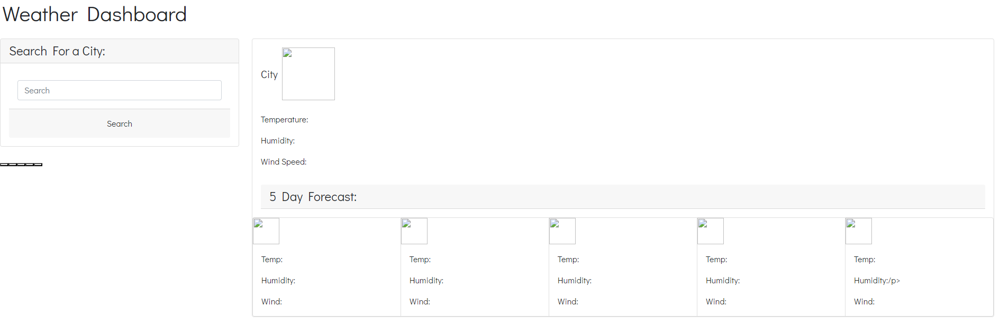
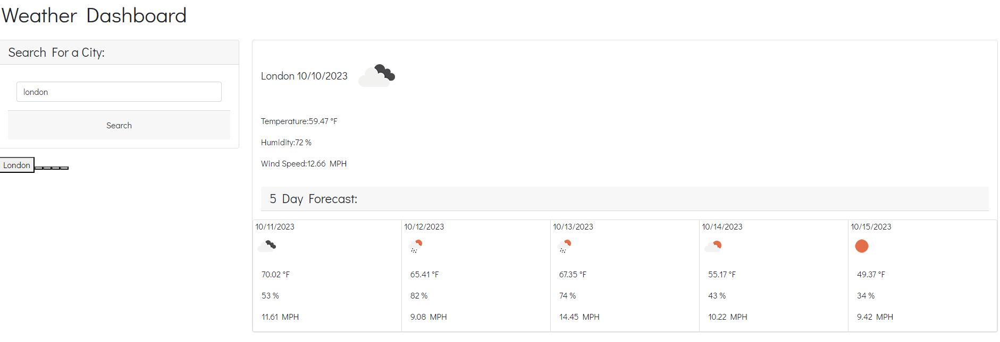
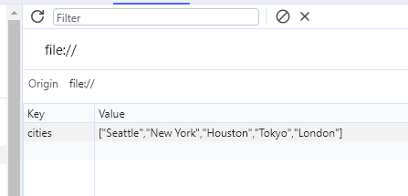

# weather-app
04 Web APIs Challenge: Code Quiz

**Goal**
To build a timed coding quiz with multiple-choice questions that saves the high score in your local storage. 

**Scope of Work**
The user has to answer five multiple choice questions to receive a high score. The timer will begin as soon as the user click on *Start* button. The timer will continue as the user go through the questions. If the user answers incorrectly then they will be penalized with subtract 10 seconds. At the end the user will have their score displayed and the user will have to put in their initial to view on the *High Score* page. 

**The quiz should contain the following:**
The quiz should be TIMED
Penalized user -10secs whenever the user answers it incorrectly
Store the high score in Local Storage. 

**Quiz Page**

**The user has to go through series of questions.**

**Enter Initial page**

**High Score page**

**The user will be shown the below page if time is up**

**Languages**
HTML, CSS, JavaScript

**Credits**
Edited by Kai Gurung-Doll; https://github.com/KaiDoll.
Link to the Challenge: https://kaidoll.github.io/Code-Quiz-Time/