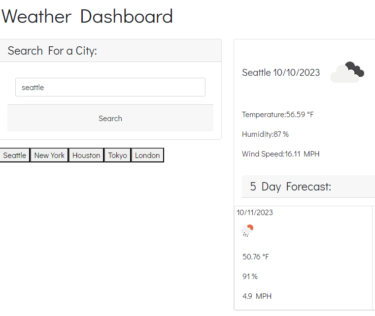

# weather-app
06 Server-Side APIs Challenge: Weather Dashboard

**Goal**
To build Third-party APIs allow developers to access their data and functionality by making requests with specific parameters to a URL.

**Scope of Work**
The user will use the search bar to look for the cities. Once the user hits the button. The page will have the current & 5 day forecast displayed. The recently searched city will also be saved on the page for the user ease next time they visit the page. 

**The quiz should contain the following:**
Current and 5 day weather forecast
Open Weather API
Storing searched cities on the localStorage.

**Weather dashboard**

**The user will type in the city and get the current & 5 day forecast**

**The city is saved from recent to old**

**Languages**
HTML, CSS, JavaScript

**Libraries**
Dayjs, Bootstrap.

**Credits**
Edited by Kai Gurung-Doll; https://github.com/KaiDoll.
Link to the Challenge: https://kaidoll.github.io/weather-app/